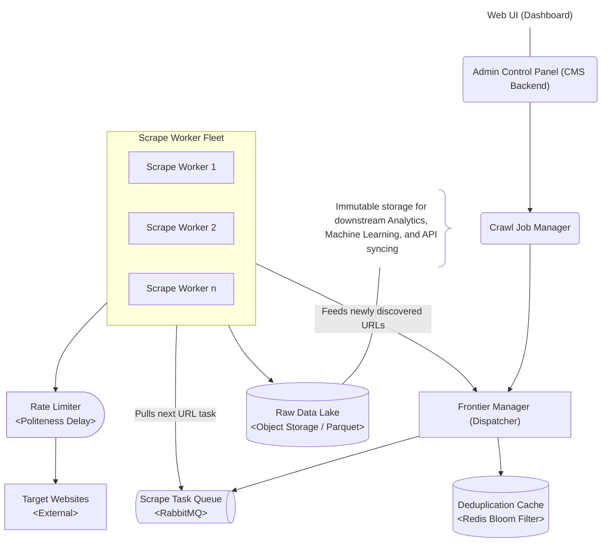

## Overall Reference Architecture

```mermaid
flowchart TB

subgraph scrapeWorkers["Scrape Worker Fleet"]

worker1["Scrape Worker 1"]

worker2["Scrape Worker 2"]

workerN["Scrape Worker n"]

end

jobManager["Crawl Job Manager"] --> frontierManager["Frontier Manager (Dispatcher)"]

cmsBackend["Admin Control Panel (CMS Backend)"] --> jobManager

webUI["Web UI (Dashboard)"] --- cmsBackend

frontierManager --> dedupCache["Deduplication Cache<br>&lt;Redis Bloom Filter&gt;"] & taskQueue["Scrape Task Queue<br>&lt;RabbitMQ&gt;"]

scrapeWorkers -- Pulls next URL task --> taskQueue

scrapeWorkers --> rateLimiter["Rate Limiter<br>&lt;Politeness Delay&gt;"] & dataLake["Raw Data Lake<br>&lt;Object Storage / Parquet&gt;"]

rateLimiter --> targetWebsites["Target Websites<br>&lt;External&gt;"]

scrapeWorkers -- Feeds newly discovered URLs --> frontierManager

storageNote["Immutable storage for downstream Analytics, Machine Learning, and API syncing"] --- dataLake

  

worker1@{ shape: rect}

worker2@{ shape: rect}

workerN@{ shape: rect}

jobManager@{ shape: rounded}

cmsBackend@{ shape: rounded}

webUI@{ shape: text}

dedupCache@{ shape: cyl}

taskQueue@{ shape: h-cyl}

rateLimiter@{ shape: delay}

dataLake@{ shape: db}

storageNote@{ shape: brace-r}
```

