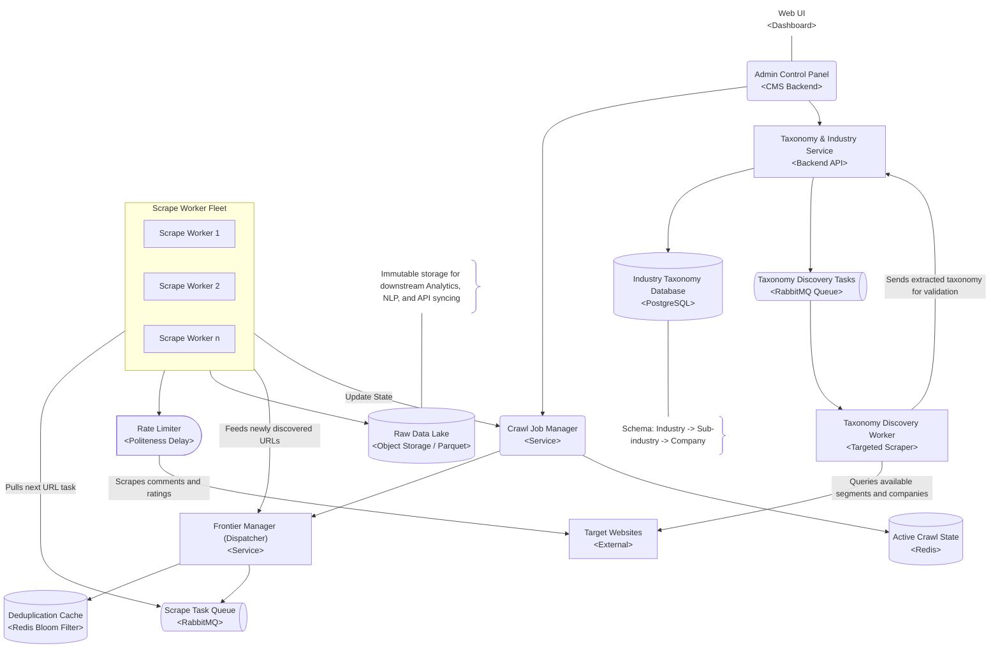

```mermaid
flowchart TB

subgraph scrapeWorkers["Scrape Worker Fleet"]

worker1["Scrape Worker 1"]

worker2["Scrape Worker 2"]

workerN["Scrape Worker n"]

end

jobManager["Crawl Job Manager<br>&lt;Service&gt;"] --> frontierManager["Frontier Manager (Dispatcher)<br>&lt;Service&gt;"] & crawlStateDB["Active Crawl State<br>&lt;Redis&gt;"]

cmsBackend["Admin Control Panel<br>&lt;CMS Backend&gt;"] --> jobManager & industryService["Taxonomy & Industry Service<br>&lt;Backend API&gt;"]

webUI["Web UI<br>&lt;Dashboard&gt;"] --- cmsBackend

frontierManager --> dedupCache["Deduplication Cache<br>&lt;Redis Bloom Filter&gt;"] & taskQueue["Scrape Task Queue<br>&lt;RabbitMQ&gt;"]

scrapeWorkers -- Pulls next URL task --> taskQueue

scrapeWorkers --> rateLimiter["Rate Limiter<br>&lt;Politeness Delay&gt;"] & dataLake["Raw Data Lake<br>&lt;Object Storage / Parquet&gt;"]

rateLimiter -- Scrapes comments and ratings --> targetWebsites["Target Websites<br>&lt;External&gt;"]

scrapeWorkers -- Feeds newly discovered URLs --> frontierManager

storageNote["Immutable storage for downstream Analytics, NLP, and API syncing"] --- dataLake

industryService --> industryDB["Industry Taxonomy Database<br>&lt;PostgreSQL&gt;"] & discoveryQueue["Taxonomy Discovery Tasks<br>&lt;RabbitMQ Queue&gt;"]

industryDB --- taxonomyNote["Schema: Industry -> Sub-industry -> Company"]

scrapeWorkers -- Update State --> jobManager

discoveryQueue --> discoveryWorker["Taxonomy Discovery Worker<br>&lt;Targeted Scraper&gt;"]

discoveryWorker -- "Queries available segments and companies" --> targetWebsites

discoveryWorker -- "Sends extracted taxonomy for validation" --> industryService

  

worker1@{ shape: rect}

worker2@{ shape: rect}

workerN@{ shape: rect}

jobManager@{ shape: rounded}

crawlStateDB@{ shape: cyl}

cmsBackend@{ shape: rounded}

webUI@{ shape: text}

dedupCache@{ shape: cyl}

taskQueue@{ shape: h-cyl}

rateLimiter@{ shape: delay}

dataLake@{ shape: db}

storageNote@{ shape: brace-r}

industryDB@{ shape: db}

discoveryQueue@{ shape: h-cyl}

taxonomyNote@{ shape: brace-r}
```
