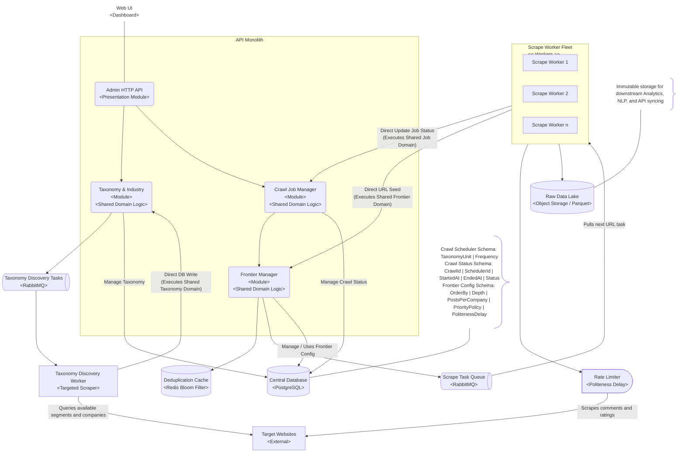

- Version: 3.1
- Change log: Fix some duplicated arrows + add Frontier config management to the database
- Reason of change: Fix diagram
- Author: #gui

```mermaid
flowchart TB

subgraph scrapeWorkers["Scrape Worker Fleet<br>&lt;&lt; Workers &gt;&gt;"]

worker1["Scrape Worker 1"]

worker2["Scrape Worker 2"]

workerN["Scrape Worker n"]

end

subgraph apiMonolith["API Monolith"]

adminPanel["Admin HTTP API<br>&lt;Presentation Module&gt;"]

taxonomyModule["Taxonomy &amp; Industry<br>&lt;Module&gt;<br>&lt;Shared Domain Logic&gt;"]

jobManagerModule["Crawl Job Manager<br>&lt;Module&gt;<br>&lt;Shared Domain Logic&gt;"]

frontierModule["Frontier Manager<br>&lt;Module&gt;<br>&lt;Shared Domain Logic&gt;"]

end

adminPanel --> taxonomyModule & jobManagerModule

webUI["Web UI<br>&lt;Dashboard&gt;"] --- adminPanel

jobManagerModule --> frontierModule

jobManagerModule -- Manage Crawl Status --> monolithDB["Central Database<br>&lt;PostgreSQL&gt;"]

taxonomyModule --> discoveryQueue["Taxonomy Discovery Tasks<br>&lt;RabbitMQ&gt;"]

taxonomyModule -- Manage Taxonomy --> monolithDB

frontierModule --> dedupCache["Deduplication Cache<br>&lt;Redis Bloom Filter&gt;"] & taskQueue["Scrape Task Queue<br>&lt;RabbitMQ&gt;"]

scrapeWorkers --> rateLimiter["Rate Limiter<br>&lt;Politeness Delay&gt;"] & dataLake["Raw Data Lake<br>&lt;Object Storage / Parquet&gt;"]

rateLimiter -- Scrapes comments and ratings --> targetWebsites["Target Websites<br>&lt;External&gt;"]

storageNote["Immutable storage for downstream Analytics, NLP, and API syncing"] --- dataLake

dbSchemaNote["Crawl Scheduler Schema: TaxonomyUnit | Frequency<br>Crawl Status Schema: CrawlId | SchedulerId | StartedAt | EndedAt | Status<br>Frontier Config Schema: OrderBy | Depth | PostsPerCompany | PriorityPolicy | PolitenessDelay"] --- monolithDB

discoveryQueue --> discoveryWorker["Taxonomy Discovery Worker<br>&lt;Targeted Scraper&gt;"]

discoveryWorker -- Queries available segments and companies --> targetWebsites

scrapeWorkers -- Direct Update Job Status<br>(Executes Shared Job Domain) --> jobManagerModule

discoveryWorker -- Direct DB Write<br>(Executes Shared Taxonomy Domain) --> taxonomyModule

scrapeWorkers -- Direct URL Seed<br>(Executes Shared Frontier Domain) --> frontierModule

taskQueue -- Pulls next URL task --> scrapeWorkers

frontierModule -- Manage / Uses Frontier Config --> monolithDB

  

worker1@{ shape: rect}

worker2@{ shape: rect}

workerN@{ shape: rect}

adminPanel@{ shape: rounded}

taxonomyModule@{ shape: rounded}

jobManagerModule@{ shape: rounded}

frontierModule@{ shape: rounded}

webUI@{ shape: text}

monolithDB@{ shape: db}

discoveryQueue@{ shape: h-cyl}

dedupCache@{ shape: cyl}

taskQueue@{ shape: h-cyl}

rateLimiter@{ shape: delay}

dataLake@{ shape: db}

storageNote@{ shape: brace-r}

dbSchemaNote@{ shape: brace-r}
```

